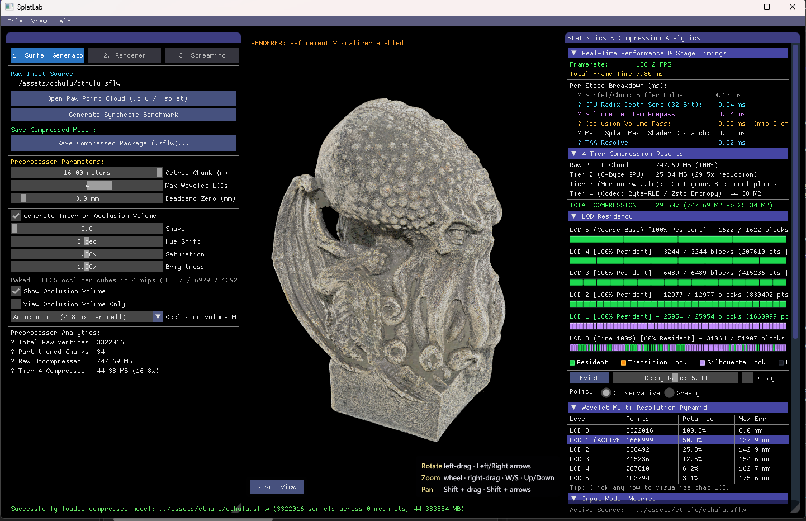
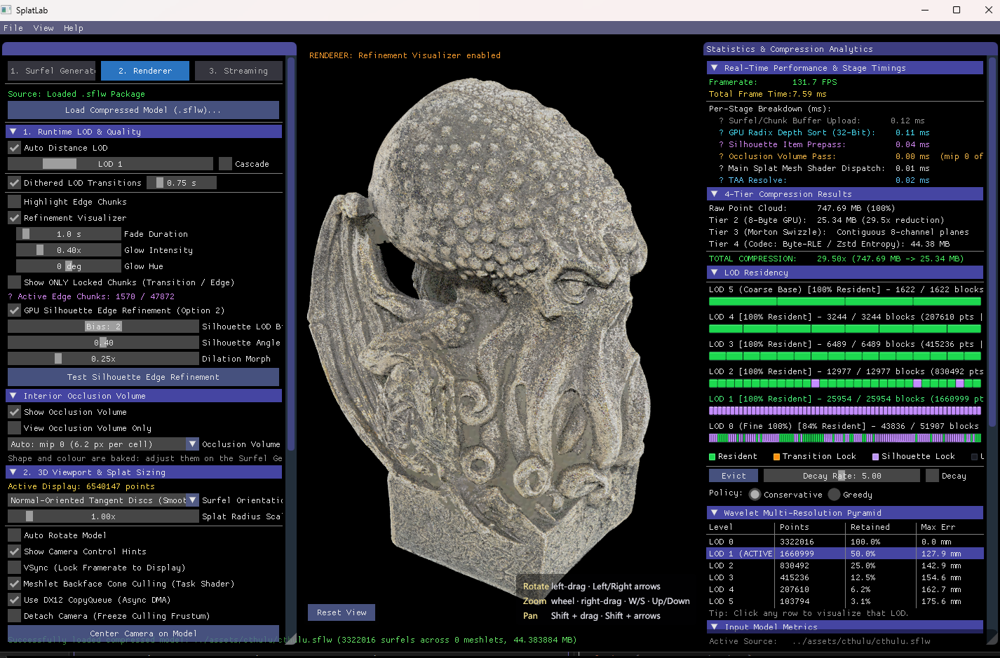
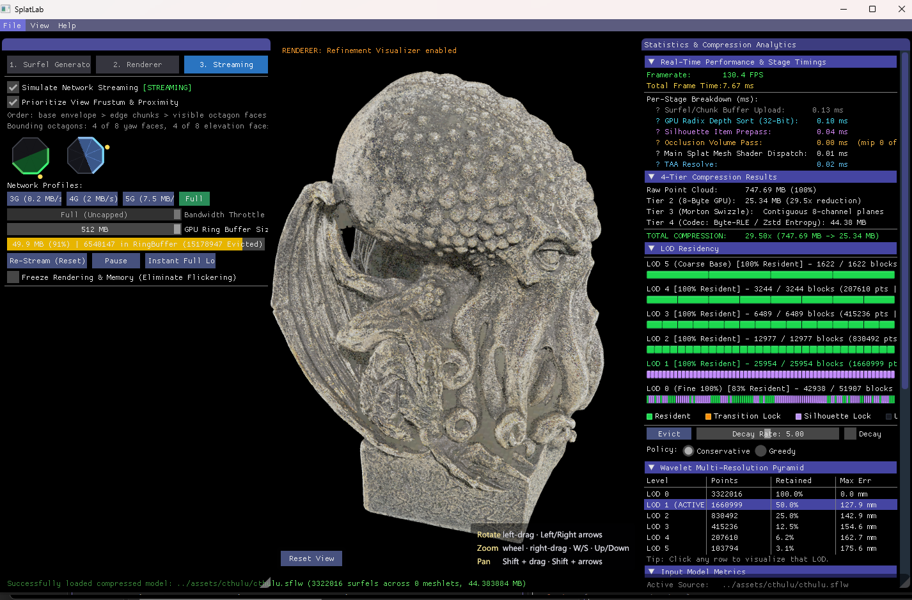

# Surfels

> Want to use the app? Start with the [User Guide](docs/USER_GUIDE.md). This README covers the architecture and the build.

Surfels is a DirectX 12 renderer and toolchain for very large point clouds and Gaussian splat scans. A scan of millions of points is packaged once into a compact, multi-resolution `.sflw` file, then streamed and drawn on the GPU as surfels: small oriented, coloured discs standing in for patches of surface. Every splat is generated, culled, sorted and cross-faded on the GPU each frame, straight from a buffer of packed surfels. There is no vertex or index buffer in the pipeline.

## Screenshots

| Surfel Generator | Renderer | Streaming |
|---|---|---|
|  |  |  |

The Cthulhu Statue scan (3.3 M points, 748 MB raw) streamed from a 44 MB `.sflw` package. The Surfel Generator tab bakes the package, the Renderer tab drives LOD and the visualisers, and the Streaming tab shows the bounding octahedron and per-level residency.

## How it works

- **Wavelet LOD pyramid.** The preprocessor partitions the scan into cubic chunks along a Morton Z-order curve, then runs a second-generation lifting wavelet decomposition with deadband sparsification over each chunk. The result is a pyramid of detail levels per chunk, written to a single `.sflw` file. At runtime chunks stream in and out of a bandwidth-throttled GPU ring buffer according to screen-space error and camera distance, with dithered (8x8 Bayer) cross-fades between levels so refinement never pops.
- **GPU silhouette detection.** A compute pass renders a low-resolution item and depth buffer, extracts screen-space silhouette edges on the GPU, and biases streaming to refine those edges first. Contours stay crisp while the rest of a receding object coarsens.
- **Interior occlusion volume.** The preprocessor can bake a solid, coloured voxel body of the model into the package, stored as a compact octree with a chain of coarser levels. The renderer draws it as depth-writing cubes, choosing the level each frame from how large its cells are on screen, so far-side surfels are occluded rather than bleeding through a sparse near side.
- **GPU-driven culling and sorting.** Per-chunk frustum culling and normal-cone backface culling run in the amplification shader, a compute pre-pass produces depth keys and the `ExecuteIndirect` arguments, and a GPU bitonic sort keeps overlapping splats in order for alpha blending. No CPU round trip.
- **Streaming scheduler.** After the coarse envelope and the silhouette chunks, a scheduler in the `bluesec-codec` core decides what streams next. The model is wrapped in a bounding octahedron, every chunk belongs to the face in front of it, and the faces the camera can see stream together while hidden faces wait. A detail grid baked into the package lets it favour some regions over others.
- **Streaming controls.** Bandwidth throttling with 3G/4G/5G presets, a decay pass that drains unused detail, and a live residency panel showing which chunks are resident, in transition or silhouette-locked at each level.
- **Hardware fallback.** Mesh shaders (D3D12 Mesh Shader Tier 1, Shader Model 6.5) are the fast path. Other D3D12 hardware runs the same stages as instanced vertex shaders, compiled for Shader Model 6.0 or, without DXIL support, through the legacy Shader Model 5.1 compiler. The picture is the same at lower frame rates, and the banner names the stages being stood in for.

The apps sit on AMD's [Cauldron](https://github.com/GPUOpen-LibrariesAndSDKs/Cauldron) framework (a git submodule under `libs/cauldron`) for device, swapchain and ImGui bootstrap. Cauldron ships no sample apps, so `src/SurfelsCore/` is written directly against its `FrameworkWindows` API.

## Solution structure

1. **`SplatLab` (Tools)**. `tools/SurfelsPreprocess/main.cpp`, a few lines that start the shared app in Studio mode: the Surfel Generator, Renderer and Streaming tabs in one window. The default startup project and what the User Guide describes.

2. **`Surfels_DX12` (Apps)**. `src/DX12/main.cpp`, the same few lines starting the shared app in Viewer mode: the Renderer and Streaming tabs with the generator hidden. Same renderer, fallback, TAA, silhouette prepass, occlusion volume and streaming simulator by construction.

3. **`surfels_core` (Core)**. `src/SurfelsCore/`, the static library both executables are built from: the app shell (`SurfelsApp`, with its Studio / Viewer mode and command-line parsing), the renderer (`SurfelsRenderer`), the `.ply` / `.splat` / `.sog` loaders, the octree, quantizer and packager, the `.sflw` types and format validators (`WaveletTypes.h`), the HLSL shaders (copied to `bin/ShaderLibDX` at build time) and the shared `WinMain` body with its crash-dump handlers (`AppEntry.cpp`). Anything both apps need lives here. The console tools include its headers directly and need neither a GPU nor Cauldron.

4. **`bluesec-codec` (Core)**. `libs/bluesec-codec/`, the algorithm core: the lifting-wavelet decomposition, the byte-shuffle and run-length codec, the interior occlusion volume generator, and the streaming scheduler with the detail grid it reads. In this repository these are proprietary source: each module is a public header (data structures and declarations) plus a `.cpp` implementation, built as a static library that `SplatLab`, `Surfels_DX12` and the console tools link against. **This subtree is not covered by the repository's Apache-2.0 `LICENSE`**; see `libs/bluesec-codec/README.md` for the boundary and its limits. A static library keeps source out of ordinary distribution but does not prevent disassembly of a shipped binary, and the shader source under `src/SurfelsCore/Shaders/` ships as plain text in `bin/ShaderLibDX/` regardless.

5. **Tests**. `tests/`, small console executables: `TestBitonicCPU` (CPU reference for the sort network), `TestGPUSort` (runs the radix sort on a raw D3D12 device against a CPU sort), `TestGeometryCull` (culling statistics), `TestLoadPackage` (loads a package and prints its counts), `TestOcclusionVolume` (runs the occlusion generator on a package) and `CompressVenus` (command-line packager, used to regenerate the bundled assets).

6. **Docs** lists `README.md` and `docs/USER_GUIDE.md` in Solution Explorer. **ThirdParty/Cauldron** holds every vendored Cauldron target.

### Public repository

`https://github.com/dewilkinson/splatlab` is a generated public mirror of this repository. The proprietary source of `bluesec-codec` is replaced by prebuilt `.lib` binaries of the same code, with open stand-in sources as a fallback, so the public build has the full feature set while the algorithm source never appears in its history. `python scripts/sync-public-repo.py`, run from a clean working tree, rebuilds the mirror: it strips the proprietary paths from every commit, rewrites the contents of past revisions through `scripts/public-history-scrub.py` (the streaming scheduler and detail-grid scoring lived inside the app source before 2026-09-07, so those passages, the paragraphs describing them and the commit messages naming them are removed from every public commit), drops in the stand-ins, compiles this repository's codec into the prebuilt `.lib` files, swaps a few README passages, builds the result, regenerates the bundled packages, runs the stress test and pushes every branch and tag. `--no-push` inspects the result first; `--no-prebuilt-codec` publishes a stand-in-only build. `scripts/build-release.py` assembles the release zip from the built public tree.

### Package format (`.sflw`)

A package is one self-contained binary file (format version 7):

| Section | Contents |
|---|---|
| `SFLWFileHeader` | magic, version, chunk and LOD counts, global bounds, splat radius, the size of the original input file (so the compression ratio survives a reload), absolute offsets of the manifest, the occlusion volume with its mip table (v6+) and the detail grid (v7+) |
| Chunk LOD payloads | one compressed blob per chunk per level, in export order |
| Occlusion voxels | optional `OcclusionVoxelGPU` array holding the mip chain back to back, mip 0 first; a pre-v6 reader that draws the whole array still sees a correct volume |
| Detail grid | optional `uint8` grid, one byte per cell over the model's bounds, read by the streaming scheduler; see `libs/bluesec-codec/DetailHeatmap.h` |
| Manifest table | one `ChunkManifestRecord` per chunk (id, bounds, centre, radius, LOD count) followed by its `ChunkLODHeader` array (surfel count, byte sizes, payload offset, geometric error) |

Every offset is absolute, so the manifest is written last and the header patched once all offsets are known. Formats 1 to 3 kept the manifest in a companion `.json`, which both apps still read when it sits next to the `.sflw`. Loading validates the header, the manifest and every payload and reports a specific reason when a file is not a valid package. See `src/SurfelsCore/WaveletTypes.h` for the structs and the version history.

### Command line

Both executables take the same options and differ only in their default mode:

```bat
SplatLab.exe [options] [file]
Surfels_DX12.exe [options] [file]
```

| Option | Effect |
|---|---|
| `file` | A `.sflw` package to open, or in Studio mode a `.ply` / `.splat` to preprocess. Dropping a file on the executable does the same. Without it, the `startup_dataset` from `config.json` opens. |
| `--viewer` | Viewer mode: the Renderer and Streaming tabs only. The default for `Surfels_DX12.exe`. |
| `--studio` | Studio mode: all three tabs. The default for `SplatLab.exe`. |
| `--render-path <p>` | GPU path for this run: `auto`, `mesh`, `vs6` or `vs5`. Overrides `render_path` in `config.json` without changing it. |
| `--help`, `-h`, `/?` | Show the usage, on the console when started from a prompt and in a dialog. |

## Building

Prerequisites, per [Cauldron's README](https://github.com/GPUOpen-LibrariesAndSDKs/Cauldron): CMake 3.24 or newer and Visual Studio 2019 or newer (MSVC toolset 142+) with the Windows 10 SDK. No Vulkan SDK is needed; the root `CMakeLists.txt` forces `GFX_API=DX12`.

```bat
git clone --recurse-submodules https://github.com/dewilkinson/surfels.git
cd surfels
mkdir build && cd build
cmake .. -G "Visual Studio 18 2026" -A x64
```

Use whichever Visual Studio generator matches your install; `"Visual Studio 17 2022"` works the same way. If you cloned without `--recurse-submodules`, run `git submodule update --init --recursive` first.

**Cauldron is prebuilt.** `libs/cauldron-prebuilt/lib/{Debug,Release}/` ships `Cauldron_Common`, `Cauldron_DX12` and `ImGUI` as static libraries through [Git LFS](https://git-lfs.com/), so run `git lfs install` once per machine before cloning, or `git lfs pull` afterwards. The `CAULDRON_USE_PREBUILT` option (on by default) links them instead of compiling Cauldron's sources, and falls back to a from-source build when the `.lib` files are missing. Pass `-DCAULDRON_USE_PREBUILT=OFF` to force the from-source build, for instance when patching Cauldron. The `.ply` scans under `assets/` are LFS objects too.

Open the generated solution in `build/` (`Surfels_DX12.slnx` with the VS 2026 generator, `.sln` with older ones) or run `cmake --build . --config Release`. Executables and shaders land in `bin/`: every `.hlsl` under `src/SurfelsCore/Shaders/` is copied to `bin/ShaderLibDX/` for `CompileShaderFromFile` to find at runtime. Debug binaries get a `d` suffix. Release builds keep full optimisation and also emit PDBs.

**Use a Visual Studio generator, not Ninja.** Cauldron's `src/Common` and `src/DX12` both copy overlapping FidelityFX headers into `bin/ShaderLibDX`. MSBuild tolerates that; Ninja rejects it. If you open the folder directly in Visual Studio, `CMakeSettings.json` must name a Visual Studio generator (it ships set to `"Visual Studio 18 2026 Win64"`).

### Runtime configuration

The apps read an optional `config.json` from the working directory or a few parent directories (`surfels_config.ini` is also accepted). Keys read: `startup_dataset` (opened when no file is given), `render_path` (`auto`, `mesh`, `vs6`, `vs5`), `occlusion_shave_bias` (extra cells added to the occlusion volume's automatic cull band, for a noisy scan that still shows cubes poking through), `show_control_hints` and `last_dialog_folder`. The file written when none exists also lists a few informational defaults that are not parsed. Without a config file the bundled `assets/cthulu/cthulu.sflw` loads; `assets/venus/venus.sflw` can be opened from the File menu. Both are regenerated with `CompressVenus` whenever the pipeline changes.

Both example scans come from [SuperSplat](https://superspl.at) and carry their authors' Creative Commons terms, which govern the datasets and the packages derived from them independently of the software's license. See the `LICENSE.txt` beside each: the Cthulhu Statue by Christoph Schindelar is CC BY 4.0, and the Venus de Milo scan by Nicolas Diolez is CC BY-NC 4.0 (**non-commercial use only**).

## Notes and known gaps

- The main splat pass binds a depth buffer but disables hardware depth test and write on purpose. Overlapping splats are alpha-blended, so visual order comes from the GPU bitonic sort; a hardware Z-test would reject translucent surfaces behind whatever drew first. The silhouette item-prepass and the occlusion-volume cube pass use a real depth test because they need nearest-item-wins occlusion.
- `.sog` (PlayCanvas Spatially Ordered Gaussians) support exists as a loader header (`SOGLoader.h`, with its own ZIP/DEFLATE and WebP decode) but is not yet wired into the file dialog.
- Both apps call `InitDirectXCompiler()` before `CreateShaderCache()`. Skip it and every shader compile fails silently with a `SpvSize != 0` assert.
- Cauldron's `DXCompileToDXO` has a use-after-free in its error path that swallows the real DXC error text, so a shader compile error shows up as the assert above with nothing useful in `Cauldron.log`. It is vendored code and not patched here.

## Where this goes next

Real scene geometry is the normal path today. The obvious next step toward a surfel global-illumination renderer is an irradiance accumulation and shading pass; splats currently get per-surfel colour with a flat two-sided diffuse term and no global illumination.

## Contributing

The public repository at `github.com/dewilkinson/splatlab` is a generated mirror whose history is rewritten on every sync, so a pull request opened against it cannot be merged and will be closed. Bug reports and feature requests are welcome as GitHub issues there. Code contributions are accepted by prior arrangement with the author, so they can be applied to the source of truth and re-published; contact details are in the About dialog.

## License

The source code in this repository is licensed under the [Apache License, Version 2.0](LICENSE), with these exceptions:

- `libs/bluesec-codec/` (the proprietary algorithm core) is **All Rights Reserved** and not covered by the Apache License; see that directory's README for the boundary. The public mirror ships it as prebuilt binaries under the bluesec-codec Binary License (`scripts/public-release-stubs/libs/bluesec-codec/prebuilt/LICENSE.txt`), which lets anyone use the binaries, copy them with the repository and ship them inside builds of the project.
- `libs/cauldron/` is AMD's Cauldron framework under the MIT License (`libs/cauldron/license.txt`, third-party notices in `libs/cauldron/NOTICES.txt`).
