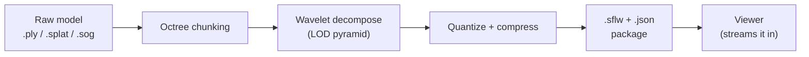
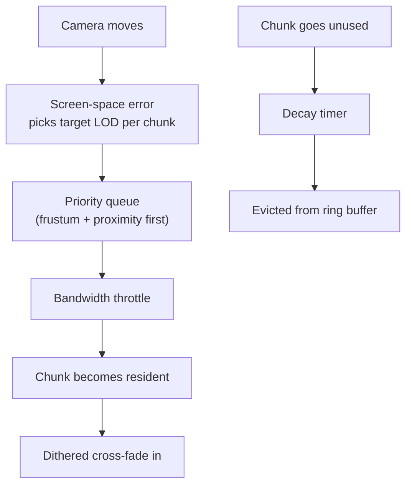
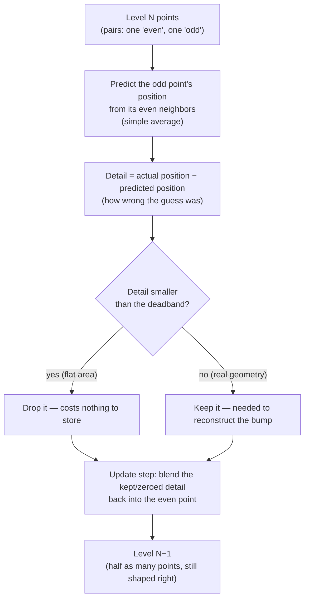

# Surfel Streaming Demo User Guide

This guide explains how to use the app — for the technical deep-dive see [README.md](../README.md).

## Overview

Surfels is two programs sharing one GPU-driven mesh-shader renderer:

- **SurfelsPreprocess** — the workbench. Load a point cloud, tune how it gets chunked and compressed, export a streamable package.
- **Surfels_DX12** — the lightweight viewer. Loads a package and streams it, nothing else.

## Getting started

**Just want to run it?** Grab the latest build from the [Releases page](../../../releases) — unzip and run `SurfelsPreprocess.exe`. No install, no GPU driver hoops beyond a DX12 Ultimate–class card (RTX 20-series+, RDNA2+).

**Building from source?** See the Building section in [README.md](../README.md) — short version: `cmake .. -G "Visual Studio 17 2022" -A x64` and open the solution.

On first launch the app auto-loads a built-in Cthulhu bust so you're never staring at an empty window.

## The Preprocessor Tab: Convert point clouds into Surfel Streaming Format (.sflw)

Tab **1. Surfel Generator**:

1. **Open Raw Point Cloud** — pick a `.ply`, `.splat`, or `.sog` file. Or click **Generate Synthetic Benchmark** if you just want something to poke at.
2. Tune the sliders:
   - **Octree Chunk (m)** — how big each spatial chunk is. Smaller = finer streaming granularity, more chunks.
   - **Max Wavelet LODs** — how many detail levels to build (more = smoother distance falloff, longer processing).
   - **Deadband Zero (mm)** — how aggressively near-flat detail gets thrown away. Higher = smaller files, blurrier close-ups.
   - **Generate Interior Occlusion Volume** — bakes a closed, coloured voxel proxy of the whole model (the surface shell plus everything it encloses) so you can't see clean through it from certain angles. On by default; **Voxel Resolution** controls how finely it follows the surface.
3. **Update Pipeline**, then **Save Compressed Package (.sflw)...** once you're happy.

That's it — you now have a `.sflw` + `.json` pair you can hand to the viewer or reload later.

## The Renderer Tab: Stream and Render a .sflw model

Tab **2. Renderer** is where you actually look at things. A few controls worth knowing:

- **Auto Distance LOD** — the default. The camera distance drives which detail level shows; walk up close and it refines automatically.
- **Dithered LOD Transitions** — smooths the pop between levels into a soft dissolve instead of a hard swap.
- **GPU Silhouette Edge Refinement** — keeps outlines crisp even when the rest of the model is coarse. This is the trick that makes distant objects still look sharp around their edges.
- **Splat Radius Scale** — bigger splats fill gaps in sparse data, but can look blobby up close. Start at 1.0x.

If you baked an occlusion volume, an **Interior Occlusion Volume** section appears here with its own enable checkbox (off by default) and a **Live Shrink** slider. The volume's outer cubes contain the surface itself, so shrink shaves the outer skin off the whole solid by the given number of voxel cells — as one body, never breaking up into gapped cubes — until the proxy sits just beneath the surfels. Raise it if cubes poke through, lower it if far-side surfels leak in. **View Occlusion Volume Only** shows just the baked solid so you can sanity-check it against the model.

## The Streaming tab: Network streaming simulator

Tab **3. Streaming** simulates progressive delivery over a constrained connection — handy for demos and for stress-testing the LOD system.

- **Network Profiles** — one-click 3G / 4G / 5G bandwidth presets, or drag the slider yourself.
- **Decay Rate** — how fast unused detail drains back out of memory when you're not looking at it. 0 is no decay; 10 drains every evictable level in about 3 seconds on any bandwidth setting, and 5 takes twice as long. Hover the slider for the implied drain time.
- **Greedy vs Conservative** — Greedy keeps pre-fetching everything in the background; Conservative only pulls what's actually visible.

The **LOD Residency** panel (right side) shows exactly what's resident, mid-transition, or silhouette-locked at each level — green bars filling up is streaming-in-progress, made visible.

## The Performance Statistics Panel

Top to bottom, roughly in "how much should I care right now" order:

1. **Real-Time Performance & Stage Timings** — FPS and a per-stage breakdown (upload, sort, silhouette prepass, occlusion pass, main dispatch, TAA). If something's slow, this tells you which stage.
2. **4-Tier Compression Results** — how much smaller your package got and why.
3. **LOD Residency** — see above.
4. **Wavelet Multi-Resolution Pyramid** — click any row to jump straight to that LOD for inspection.
5. **Input Model Metrics / Geometry Optimizations & Culling Stats / Spatial Partitioning** — the detail-oriented stuff, safe to ignore day-to-day.

## Common gotchas

- **"My model only shows one LOD level"** — you probably loaded a `.sflw` packaged by an older version, or `Max Wavelet LODs` was set to 1. Re-export with more levels.
- **Streaming looks like a progress bar filling left-to-right instead of a patchwork** — that's the priority queue working correctly; edges and nearby chunks should still win the race even in that pattern. If it looks purely sequential/blocky, check that **Prioritize View Frustum & Proximity** is on.
- **Decay never seems to finish** — Decay Rate 10 empties every evictable level in about 3 seconds regardless of bandwidth, so if levels are still resident, they're probably pinned: the two coarsest levels never drain, and silhouette chunks in view are locked while Silhouette LOD 0 is on.
- **Edges look blocky when zoomed in close** — bump **Silhouette LOD Bias** or check that GPU Silhouette Edge Refinement is on.

## Glossary

- **Chunk** — a spatial cube of surfels, the unit of streaming.
- **Surfel** — a colored, oriented disc/point standing in for a tiny patch of surface (like a pixel, but 3D).
- **LOD (Level of Detail)** — a coarser/finer version of the same chunk; the wavelet pyramid has several.
- **Silhouette chunk** — a chunk currently on the model's outline from the camera's point of view; gets refined first.
- **Decay** — the simulated cache eviction that drains unused detail back out to free memory.

## Appendix: Lifting Wavelet Compression

Each coarser level isn't just "every other point deleted" — it's built with a **second-generation lifting wavelet**, the same family of technique used in JPEG2000. The short version: it throws away detail *intelligently*, keeping the overall shape solid even after several rounds of halving.

For every pair of neighboring points at a level:

Two things make this better than naive decimation:

- **Predict, don't delete.** The "odd" point isn't just thrown away — the gap between where it *should* be (predicted from neighbors) and where it *actually* is becomes the "detail" coefficient. Flat, boring areas predict almost perfectly, so their detail is tiny.
- **Deadband sparsification.** Any detail coefficient below the `Deadband Zero (mm)` threshold gets zeroed outright. On a mostly-flat surface (a wall, a road, a torso) that's most of them — which is exactly why the compression ratio you see in the Compression Results panel looks so good.

The "update" step also folds the surviving detail back into the coarser point so it doesn't drift — and it re-averages normal/color and scales the splat radius up by `√2` per halving, so a coarse point still covers the same physical area its two children used to.

This repeats level by level until you hit `Max Wavelet LODs` or there just aren't enough points left to keep splitting.
