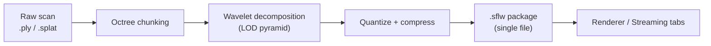
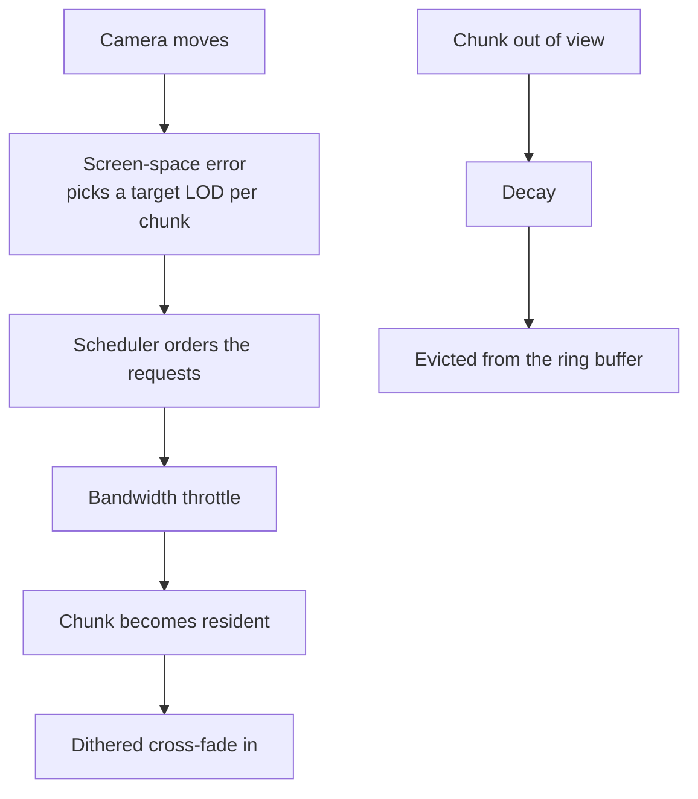
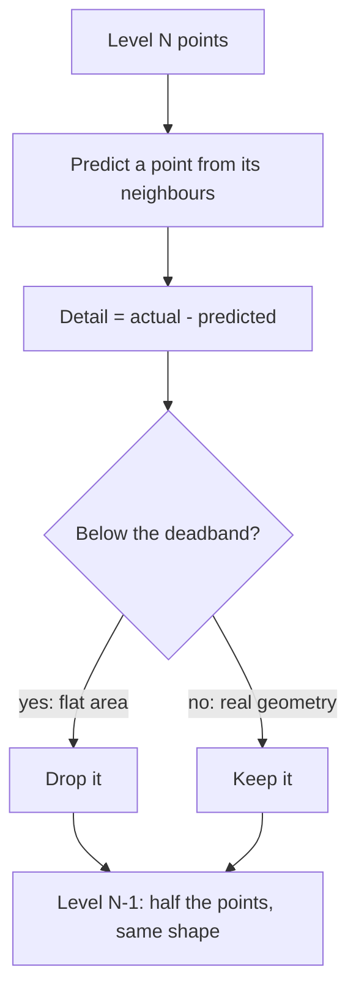

# SplatLab User Guide

This guide explains how to use SplatLab. For the architecture and build instructions, see [README.md](../README.md).

## Overview

SplatLab turns large point clouds and Gaussian splat scans into compact, multi-resolution packages, then streams and renders them on the GPU. A scan of a few million points becomes a single `.sflw` file that opens in seconds, loads coarse-to-fine as you look at it, and stays sharp where it matters.

A few concepts carry through the whole application:

- **Surfel.** A small coloured disc with a position and a normal, standing in for a patch of surface. It is the 3D equivalent of a pixel, and everything SplatLab renders is made of them.
- **Chunk.** A spatial cube of surfels, a few thousand at most. Chunks are the unit of streaming: they arrive, refine and leave memory independently.
- **LOD pyramid.** Every chunk exists at several levels of detail, from a coarse envelope of a few points to the full-resolution scan. The Surfel Generator builds the pyramid once, using a wavelet decomposition that keeps shape while it halves the point count (see the appendix).
- **Package (`.sflw`).** One self-contained file holding every level of every chunk, compressed, plus the metadata the viewer needs: the chunk manifest, an optional interior occlusion volume and a detail grid that guides streaming.
- **Streaming.** The viewer never needs the whole file at once. Chunks are requested at the level the view calls for, arrive in a priority order, cross-fade in, and can be evicted again when memory is tight. SplatLab simulates the network so you can watch this happen.
- **Interior occlusion volume.** A solid, coloured voxel body baked inside the model. It stops the far side of a sparse scan from showing through the near side.

### One application, two modes

SplatLab ships as two executables built from the same code:

- **`SplatLab.exe`** runs in Studio mode: three tabs that take a dataset from raw scan to streamed render. **Surfel Generator** loads a `.ply` or `.splat`, exposes the packaging parameters and saves a `.sflw`. **Renderer** shows the current dataset or any package with level-of-detail, visualiser and occlusion controls. **Streaming** simulates delivery over a constrained connection and shows what is resident.
- **`Surfels_DX12.exe`** runs in Viewer mode: the Renderer and Streaming tabs only, with the generator hidden. Use it where people only need to open packages.

Either executable can start in either mode with a switch, and both accept a file on the command line, so dropping a package or a scan onto the executable opens it directly.



### Command line

```bat
SplatLab.exe [options] [file]
Surfels_DX12.exe [options] [file]
```

| Option | Effect |
|---|---|
| `file` | A `.sflw` package to open, or in Studio mode a `.ply` / `.splat` to preprocess. Without it, the `startup_dataset` from `config.json` opens. |
| `--viewer` | Viewer mode: Renderer and Streaming tabs only. The default for `Surfels_DX12.exe`. |
| `--studio` | Studio mode: all three tabs. The default for `SplatLab.exe`. |
| `--render-path <p>` | GPU path for this run: `auto`, `mesh`, `vs6` or `vs5`. Overrides `render_path` in `config.json` without changing it. |
| `--help`, `-h`, `/?` | Show the usage, on the console when started from a prompt and in a dialog. |

## Getting started

**Release build.** Download the latest zip from the [Releases page](../../../releases), extract it anywhere and run `Run SplatLab.cmd`. No installation is needed. The bundled Cthulhu Statue scan loads on first launch, so the window is never empty.

**Hardware.** Any Direct3D 12 GPU works. GPUs with mesh shaders (GeForce RTX 20-series or newer, Radeon RX 6000 or newer, Intel Arc) run the fast path. Other hardware falls back to instanced vertex shaders automatically, drawing the same picture at lower frame rates. When the fallback is active a dialog says so at launch, the top-left banner lists the stages it stands in for, and Help > About names the path in use.

**Building from source.** The Building section of [README.md](../README.md) has the full procedure. In short: run `cmake .. -G "Visual Studio 18 2026" -A x64` from a `build/` directory and open the generated solution. SplatLab is the startup project.

**Camera.** Left-drag or the Left/Right arrows rotate. The mouse wheel, right-drag, W/S or Up/Down zoom. Shift with any drag or with the arrow keys pans. A faint reminder sits in the bottom-right corner of the viewport, and **Show Camera Control Hints** on the Renderer tab hides it. **Reset View** in the bottom-left corner returns to the launch view.

**The banner.** Whenever a toggle changes what the viewport shows, a row at the top-left names it, as in `RENDERER: View Occlusion Volume Only enabled`. If the picture looks wrong, read the banner first: it names the tab and control responsible, and turning that control off restores the normal view. A red `CODEC:` row means the build is running the open stand-in codec rather than the bundled `bluesec-codec` library, and lists what that build lacks.

## Surfel Generator tab

This tab converts a point cloud into a `.sflw` package.

1. **Open Raw Point Cloud** picks a `.ply` or `.splat` file. **Generate Synthetic Benchmark** builds a procedural street scene to experiment with.
2. Adjust the parameters. Every control is live. The chunking and wavelet sliders re-run the pipeline when you release them, and the occlusion volume controls rebuild the volume while you drag.
   - **Octree Chunk (m)** sets the edge length of each chunk. Smaller chunks stream at a finer grain but there are more of them.
   - **Max Wavelet LODs** sets how many detail levels to build. More levels give a smoother fall-off with distance and take longer to process.
   - **Deadband Zero (mm)** is the threshold below which near-flat detail is discarded. Higher values give smaller files and softer close-up detail.
   - **Generate Interior Occlusion Volume**, on by default, bakes a solid, coloured voxel body of the model, stored as a compact octree with a chain of coarser levels. The cell size follows the point density. Stray points away from the surface are ignored, and cubes that would show through the surfel surface are removed automatically, so the volume never clips outside the model. The panel reports the resolution chosen, the block count of each level and how many cubes were removed. If a scan still shows cubes poking through, the `occlusion_shave_bias` key in `config.json` widens that removal.
   - **Shave** erodes the volume further inside the model, from 0 (the largest body that fits) to 10 (a thin core along the model's length). The cut scales with local thickness, so thin and thick parts shrink together. The shape is fixed when the package is saved and cannot be changed in the viewer.
   - **Hue Shift**, **Saturation** and **Brightness** grade the volume's colour. The defaults of 0, 1 and 1 leave the sampled colour as it is. The graded colour is written into the package.
3. **Save Compressed Package (.sflw)** writes the result with the current parameters.

The output is one `.sflw` file. Open it in the Renderer tab, reload it later, or hand it to someone with the viewer.

## Renderer tab

This is where you examine a model. The controls that matter most:

- **Auto Distance LOD**, the default. Camera distance picks the detail level per chunk, so the model refines as you approach. Turn it off to hold a level by hand.
- **Dithered LOD Transitions** replaces the switch between levels with a soft dissolve.
- **Refinement Visualizer**, on by default, tints every chunk as it arrives. The newest chunks glow, settle to the regular tint and fade out. Sliders set the fade duration, glow intensity and hue. Press **Evict** on the residency panel and watch the model grow back.
- **GPU Silhouette Edge Refinement** keeps outlines crisp while the interior of the model is still coarse.
- **Splat Radius Scale**. Larger splats fill gaps in sparse data but look blobby up close. 1.0x is the place to start. **Auto Splat Size**, on by default, sizes discs from each level's measured point spacing.
- **Detach Camera** (Ctrl+D) freezes the culling camera where the view is and steps the view aside so you can inspect the culling from any angle. The model is exactly what the frozen camera would render, its level of detail included: surfels it would draw keep their colour, mid grey where you see their backs, and everything it would have culled, including the far half of the model beyond its centre, stays on screen in dark grey. The occlusion volume shows only the faces turned toward the frozen camera, and its frustum is drawn.

**Interior Occlusion Volume.** **Show Occlusion Volume**, on by default, draws the volume and depth-tests surfels against it. **View Occlusion Volume Only** shows the solid alone for comparison with the model. When the package carries several levels, an **Occlusion Volume Mip** selector appears. On **Auto** the renderer picks one level per frame from how large its cells are on screen, so the volume coarsens as the surfels do. Choosing a level forces it, which is handy with View Occlusion Volume Only. Shape and colour are set when the package is baked; the Surfel Generator tab has those sliders.

## Streaming tab

This tab simulates delivery over a constrained connection. It is useful for demonstrations and for stressing the level-of-detail system.

- **Network Profiles** offer 3G, 4G and 5G presets, or a slider for any bandwidth. Streaming is unthrottled until you pick one.
- **Decay Rate** sets how fast detail that is out of view drains from memory. 0 disables decay. 10 drains every evictable level in about ten seconds whatever the bandwidth, and 5 takes twice as long. Hover over the slider for the implied drain time. **Evict** clears everything but the two coarsest levels at once.
- **Conservative** (the default) fetches what is in view plus a small margin around it and evicts detail the view drops back from. **Greedy** keeps prefetching the rest of the model in the background.
- **Prioritize View Frustum & Proximity** lets the current view reorder the scheduler's ranking so in-view regions arrive first. Off, the scheduler's model-wide order applies.

**Streaming order.** The two coarsest levels always land first, so there is a solid envelope. Silhouette chunks come next. After that the streaming scheduler, part of the `bluesec-codec` core, decides what streams. The model is wrapped in a bounding octahedron and every chunk belongs to the face in front of it. Each frame, the faces the camera can see stream together, faces out of view wait, and a face starts streaming the moment it comes into view. A detail grid baked into the package lets the scheduler favour some regions over others. The tab draws the octahedron as two diamonds, green for the upper faces and blue for the lower ones, with visible faces lit, an inner triangle growing as each face fills, and a yellow dot for the camera's direction. Builds running the open stand-in codec stream in plain chunk order instead and say so in the banner.

The **LOD Residency** panel on the right shows which chunks are resident, in transition or silhouette-locked at each level. Green bars filling in are streaming made visible.



## Statistics panel

The right-hand panel is ordered by how often each section is consulted:

1. **Real-Time Performance & Stage Timings.** Frame rate, a per-stage GPU breakdown (upload, sort, silhouette prepass, occlusion pass, main dispatch, TAA) and a CPU frame budget. When performance drops, this names the stage responsible.
2. **4-Tier Compression Results.** The size of the original scan against the size of the package, with the contribution of each stage. The original size is stored in the package, so the ratio survives a reload.
3. **LOD Residency.** Described above.
4. **Wavelet Multi-Resolution Pyramid.** Click a row to view that level.
5. **Input Model Metrics**, **Geometry Optimisations & Culling Stats**, **Spatial Partitioning.** Diagnostics you can ignore in ordinary use.

## Common issues

- **The model shows a single LOD level.** The package came from an older version, or **Max Wavelet LODs** was 1. Re-export with more levels.
- **A package refuses to load.** The dialog names the reason: wrong file type, a newer format version, a truncated file, or a package baked with a different codec build. Retry with a fresh copy, or re-bake it from the original scan.
- **Decay never finishes.** At rate 10 every evictable level drains in about ten seconds. What remains is pinned: the two coarsest levels never drain, and silhouette chunks in view stay locked while GPU Silhouette Edge Refinement is on.
- **Edges look blocky up close.** Raise **Silhouette LOD Bias**, or check that GPU Silhouette Edge Refinement is on.
- **The picture looks wrong.** Read the top-left banner. It names every active debug view, isolation mode, forced level and frozen state.

## Glossary

- **Surfel.** A coloured, oriented disc standing in for a patch of surface.
- **Chunk.** A spatial cube of surfels, the unit of streaming.
- **LOD (level of detail).** A coarser or finer version of the same chunk. The wavelet pyramid holds several.
- **Silhouette chunk.** A chunk on the model's outline from the camera's point of view. These refine first.
- **Occlusion volume.** The solid voxel body baked inside the model so its far side cannot show through.
- **Detail grid.** A coarse grid stored in the package that the streaming scheduler reads.
- **Decay.** The simulated cache eviction that drains unused detail from memory.
- **Residency.** Which chunks, at which levels, are currently held in the GPU ring buffer.

## Appendix: wavelet compression

Each coarser level of the pyramid is not the finer level with every other point deleted. It is built with a second-generation lifting wavelet, the family of technique used in JPEG 2000, which discards detail selectively and keeps the overall shape through several halvings.

For each pair of neighbouring points, the position of one is predicted from its neighbours. The difference between the prediction and the real position is a detail coefficient. On flat surfaces the prediction is nearly perfect and the coefficient is tiny. Any coefficient below the **Deadband Zero (mm)** threshold is set to zero and costs nothing to store, which is why walls, roads and torsos compress so well. The surviving point carries the level below it, and the process repeats until **Max Wavelet LODs** is reached or too few points remain to split.


