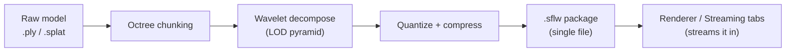
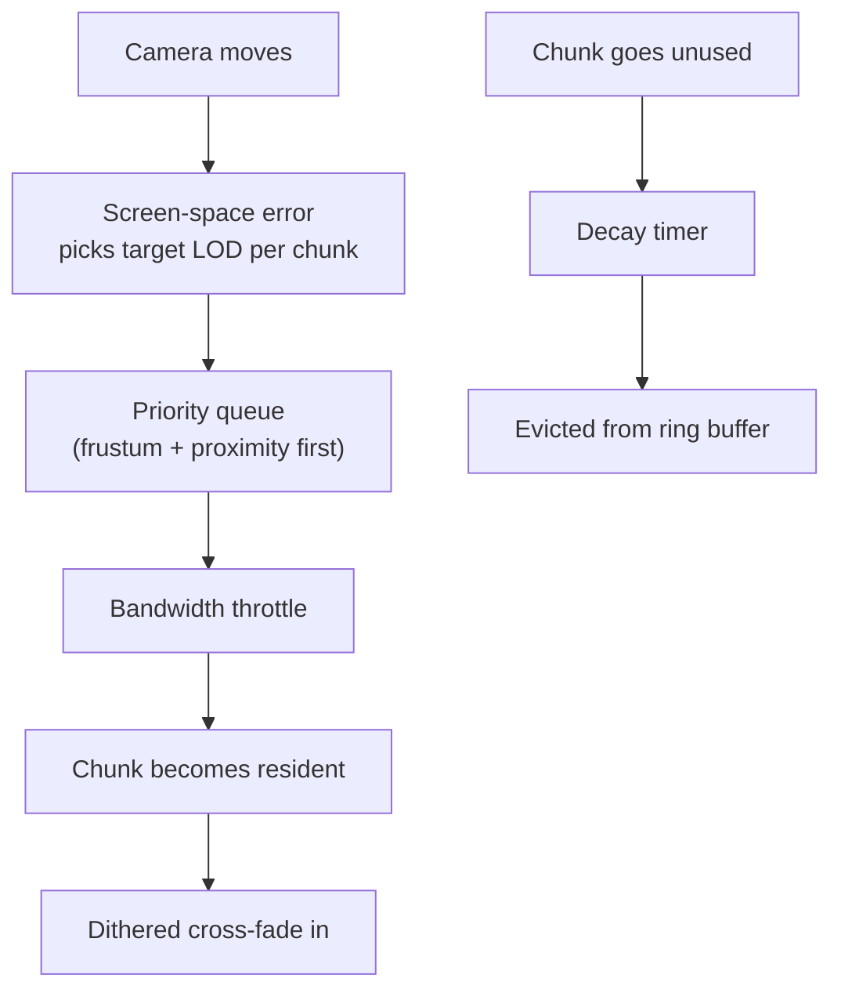
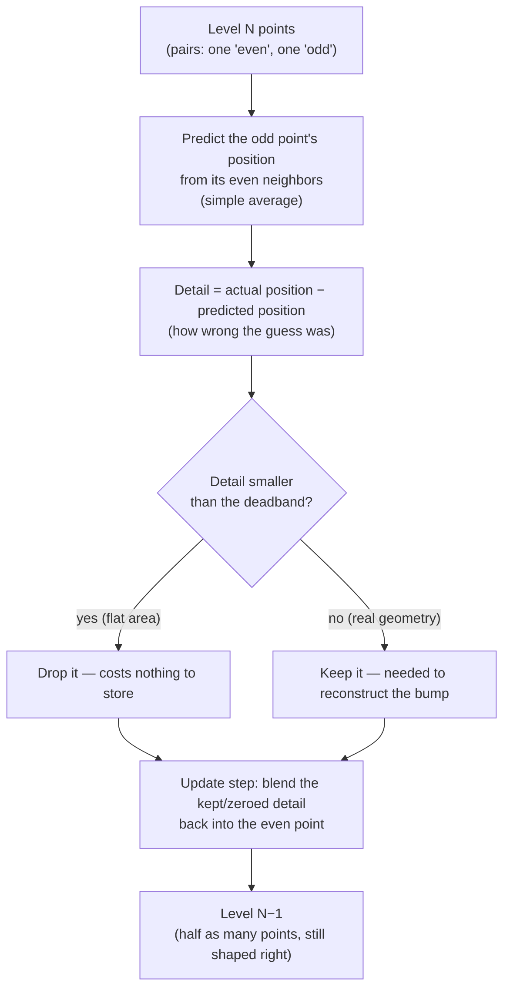

# SplatLab User Guide

This guide describes how to operate the software. Readers seeking the technical architecture should consult [README.md](../README.md).

## Overview

The primary application is **SplatLab**, a single window that combines the preprocessor and the viewer. Its three tabs carry a dataset from raw point cloud to streamed render without leaving the program:

1. **Surfel Generator** — loads a `.ply` or `.splat` file, exposes the chunking and compression parameters, and exports a `.sflw` package.
2. **Renderer** — displays the current dataset, or any previously exported package, using the GPU-driven mesh-shader renderer, with level-of-detail controls and the interior occlusion volume.
3. **Streaming** — simulates progressive delivery over a constrained connection and visualises which detail levels are resident.

SplatLab is the recommended entry point, and every section of this guide describes it.

### Standalone versions

The same renderer is also available as separate components for situations in which only one half is required:

- **Surfels_DX12** is the standalone viewer. It is SplatLab's Renderer and Streaming tabs without the Surfel Generator tab: the same window, controls, banners and dialogs, with the raw point cloud items removed from the File menu. It is intended for viewer-only distributions. It accepts a `.sflw` path on its command line (drop a package onto `Surfels_DX12.exe` or onto `bin/launch.cmd`) and otherwise opens the `startup_dataset` named in `config.json`, exactly as SplatLab does; File > Open Compressed Model (Ctrl+O) loads another package.
- **The preprocessor on its own.** SplatLab accepts a file path on its command line. Dropping a point cloud onto `SplatLab.exe` (or onto `bin/launch_surfellab.cmd`) opens it directly in the Surfel Generator tab. A package exported from there can be opened in the standalone viewer.

Both programs are the same application code in two modes, built from one library, so the image shown in SplatLab's Renderer tab is the image the standalone viewer produces.

**Command line.** Both executables take the same options and differ only in their default mode: `SplatLab.exe [options] [file]` and `Surfels_DX12.exe [options] [file]`.

| Option | Effect |
|---|---|
| `file` | A `.sflw` package to open, or (Studio mode) a `.ply` / `.splat` point cloud to preprocess. Dropping a file on the executable does the same. Without it the `startup_dataset` from `config.json` is opened. |
| `--viewer` | Viewer mode: the Renderer and Streaming tabs only (the default for `Surfels_DX12.exe`). |
| `--studio` | Studio mode: the Surfel Generator, Renderer and Streaming tabs (the default for `SplatLab.exe`). |
| `--render-path 
` | GPU path for this run: `auto`, `mesh`, `vs6` or `vs5`. Overrides `render_path` in `config.json` without changing it. |
| `--help`, `-h`, `/?` | Show the usage (on the console when started from a prompt, and in a dialog). |

## Getting Started

**Running a release build.** Download the latest build from the [Releases page](../../../releases), extract it, and run `SplatLab.exe`. No installation is required. The only hardware requirement is a DirectX 12 Ultimate–class GPU (NVIDIA RTX 20-series or newer, AMD RDNA2 or newer).

**Hardware.** SplatLab renders with D3D12 mesh shaders where the GPU has them (GeForce RTX 20 series or newer, Radeon RX 6000 or newer, Intel Arc). On other D3D12 hardware it falls back automatically to instanced vertex shaders, compiled for Shader Model 6.0 or, on drivers without DXIL support, through the legacy Shader Model 5.1 compiler. The fallback draws the same picture at lower frame rates; when it is active the top-left banner lists each hardware stage it is standing in for, and Help > About names the path in use. Setting `"render_path"` in `config.json` to `vs6` or `vs5` forces a fallback on capable hardware for testing (`auto` is the default).

**Building from source.** The Building section of [README.md](../README.md) gives the full procedure. In brief, the user runs `cmake .. -G "Visual Studio 18 2026" -A x64` from a `build/` directory and opens the generated solution. SplatLab is the default startup project; Surfels_DX12 is available in the same solution for those who require the standalone viewer.

On first launch the application automatically loads a bundled Cthulhu bust, so the window is never empty.

## The Surfel Generator Tab: Converting Point Clouds to Surfel Streaming Format (.sflw)

Tab **1. Surfel Generator** provides the following workflow:

The output is a single `.sflw` file. It may be inspected in the Renderer tab, reloaded later, or placed beside the standalone viewer.

## The Renderer Tab: Streaming and Rendering a .sflw Model

Whenever a toggle that alters what the viewport shows is active (a debug view such as **View Occlusion Volume Only**, an isolation mode such as **Show ONLY Locked Chunks**, a tint or overlay such as **Highlight Edge Chunks** or the heatmap cubes, a detached culling camera, frozen rendering, a manually selected LOD level, or a forced occlusion mip), a banner at the top-left of the viewport lists each one as **TAB NAME: feature enabled** (for example `RENDERER: View Occlusion Volume Only enabled`), one per row in its own colour. If the model looks wrong, read the banner first: it names the tab and the toggle responsible, and switching that toggle off restores the normal picture. A **Reset View** button in the bottom-left corner of the viewport returns the camera to the launch view (default angle, centred on the model, fitted between the panels). A faint reminder of the camera controls sits in the bottom-right corner of the viewport: left-drag or the Left/Right arrows rotate, the mouse wheel, right-drag, W/S or Up/Down zoom, and Shift with any drag or with the arrow keys pans. The **Show Camera Control Hints** checkbox in the Renderer tab's viewport section hides it, and the choice is remembered in `config.json`.

Tab **2. Renderer** is where the model is examined. The most useful controls are:

- **Auto Distance LOD** — the default mode. Camera distance selects the detail level per chunk, so the model refines automatically as the camera approaches.
- **Dithered LOD Transitions** — replaces the abrupt switch between levels with a soft dissolve.
- **Refinement Visualizer** — a visualizer for progressive loading, on by default. Every chunk that arrives is filled with a semi-transparent tint; the newest chunks, which form the leading edge of the growing model, glow bright and then settle to the regular tint before fading out. Three sliders set the fade duration, the glow intensity, and the hue (rotate it for green, blue or magenta). Press **Evict** on the residency panel and watch the model grow back in the streaming order. While it is on, the top-left banner says so.
- **GPU Silhouette Edge Refinement** — keeps outlines crisp even while the interior of the model is coarse. This is the mechanism that allows distant objects to retain sharp edges.
- **Splat Radius Scale** — larger splats fill gaps in sparse data but appear blobby at close range. A value of 1.0× is the recommended starting point.

The **Interior Occlusion Volume** section has a **Show Occlusion Volume** checkbox, on by default, which draws the volume and depth-tests the surfels against it. Enabling generation on the Surfel Generator tab, or moving its Shave slider, also switches it on, so the volume is visible as soon as it exists. **View Occlusion Volume Only** displays the blocky solid alone so that it can be compared against the model. While **Detach Camera** is on, the volume is culled against the frozen camera just as the surfels are: only its faces turned toward that camera, on cubes inside its frustum, are drawn, so from the side both the model and the volume appear as the open shell the detached camera saw. The shape and colour of the volume are fixed when it is baked on the Surfel Generator tab; the Renderer tab offers no control that would alter them, and a note beneath the checkboxes directs the user back to the Surfel Generator tab for the Shave and colour sliders.

When the package carries more than one occlusion mip, an **Occlusion Volume Mip** selector appears beneath the checkboxes. In its default **Auto** setting the renderer draws one mip per frame for the whole volume: the finest mip whose cell still covers about two and a half pixels at the point of the model nearest the camera, with some hysteresis so the choice does not flicker while the camera hovers near a threshold. The selector shows which mip is in use and how many pixels one of its cells spans. This is deliberately a screen-space rule rather than one tied to the surfel LOD of each chunk: the volume is a single body, and mixing mips between chunks would open seams where a coarse block's buried face meets a neighbouring chunk that eroded that cell away. The effect is that, as the camera pulls back and the surfels coarsen into large discs, the volume's cubes and its erosion margin grow with them, so the fine skin is neither wasted as sub-pixel work nor left so tight that the big coarse-LOD splats are clipped where they sag inside a curved surface. Choosing a specific mip from the selector forces it, which is useful with **View Occlusion Volume Only** for comparing levels; the setting returns to Auto if a rebake or reload produces fewer mips. The stage timings on the Renderer tab report the occlusion volume pass together with the mip it drew.

## The Streaming Tab: Network Streaming Simulator

Tab **3. Streaming** simulates progressive delivery over a constrained connection. It is useful both for demonstrations and for stress-testing the level-of-detail system.

- **Network Profiles** — one-click 3G, 4G, and 5G bandwidth presets, or a slider for arbitrary values. Streaming is unthrottled by default, so the model loads at full speed until a profile is selected.
- **Decay Rate** — the speed at which unused detail drains out of memory when it is not in view. A value of 0 disables decay; 10 drains every evictable level in approximately three seconds regardless of bandwidth, and 5 takes twice as long. Hovering over the slider shows the implied drain time.
- **Greedy vs Conservative** — Greedy continues to pre-fetch everything in the background; Conservative fetches only what is currently visible.

The **LOD Residency** panel on the right shows precisely which chunks are resident, in transition, or silhouette-locked at each level. Green bars filling from left to right are streaming in progress, made visible.

## The Performance Statistics Panel

The panel is ordered, top to bottom, roughly by how often each section is consulted:

1. **Real-Time Performance & Stage Timings** — frame rate and a per-stage breakdown (upload, sort, silhouette prepass, occlusion pass, main dispatch, TAA). When performance drops, this section identifies the responsible stage.
2. **4-Tier Compression Results** — the size reduction achieved by the package and its causes. The headline ratio is the size of the original point-cloud file against the size of the `.sflw` file; the original size is stored inside the package so the figure survives a reload.
3. **LOD Residency** — described above.
4. **Wavelet Multi-Resolution Pyramid** — clicking any row jumps directly to that level for inspection.
5. **Input Model Metrics / Geometry Optimizations & Culling Stats / Spatial Partitioning** — detailed diagnostics that are safe to ignore in ordinary use.

## Common Issues

- **The model shows only one LOD level.** The package was probably produced by an older version, or **Max Wavelet LODs** was set to 1. Re-exporting with more levels resolves this.
- **Streaming resembles a progress bar filling left to right rather than a patchwork.** This is the priority queue behaving correctly; edges and nearby chunks should still complete first even in that pattern. If loading appears purely sequential, the user should confirm that **Prioritize View Frustum & Proximity** is enabled.
- **Decay never seems to finish.** A Decay Rate of 10 empties every evictable level in about three seconds regardless of bandwidth. Levels that remain resident are therefore pinned: the two coarsest levels never drain, and silhouette chunks in view are locked while Silhouette LOD 0 is enabled.
- **Edges appear blocky at close range.** Raising **Silhouette LOD Bias**, or confirming that GPU Silhouette Edge Refinement is enabled, corrects this.

## Glossary

- **Chunk** — a spatial cube of surfels; the unit of streaming.
- **Surfel** — a coloured, oriented disc or point standing in for a small patch of surface; the three-dimensional analogue of a pixel.
- **LOD (Level of Detail)** — a coarser or finer version of the same chunk. The wavelet pyramid holds several.
- **Silhouette chunk** — a chunk that lies on the model's outline from the camera's point of view. Such chunks are refined first.
- **Streaming order** — after the coarse envelope and the silhouette chunks, the streaming scheduler (part of the proprietary `bluesec-codec` core) decides which blocks stream next. The model is wrapped in a bounding octahedron and every block belongs to the face in front of it; each frame the faces the camera can see stream together, faces out of view wait, and a face starts streaming the moment it comes into view. The scheduler reads a coarse detail grid baked into the package (v7+) so that some regions of the model can be favoured over others; how it scores and orders them is not part of the public source. The Streaming tab shows the octahedron as two diamonds: green for the four upper faces and pastel blue for the four lower ones, both seen from above, with the visible faces lit, an inner triangle in each face growing as its blocks arrive, and a yellow dot marking the camera's direction. The Renderer tab's **Heatmap Source** control can colour the cluster cubes by the detail grid, and the Streaming tab's **Prioritize View Frustum & Proximity** checkbox decides whether the current view is allowed to reorder the scheduler's ranking (on: in-view regions first) or not (off: the scheduler's model-wide order). Builds that run the open stand-in codec instead of the proprietary one stream in plain chunk order and say so in a red `CODEC:` banner row at the top-left of the viewport, which also names the other features the stand-in lacks.
- **Decay** — the simulated cache eviction that drains unused detail out of memory.

## Appendix: Lifting Wavelet Compression

Each coarser level is not simply the finer level with every other point removed. It is built with a **second-generation lifting wavelet**, the same family of technique used in JPEG 2000. In short, the method discards detail selectively, preserving the overall shape even after several rounds of halving.

For every pair of neighbouring points at a level:

Two properties make this superior to naive decimation:

- **Prediction rather than deletion.** The "odd" point is not merely discarded. The difference between its predicted position (from its neighbours) and its actual position becomes a detail coefficient. Flat regions predict almost perfectly, so their detail coefficients are tiny.
- **Deadband sparsification.** Any detail coefficient smaller than the `Deadband Zero (mm)` threshold is set to zero outright. On a largely flat surface (a wall, a road, a torso) this applies to most coefficients, which is precisely why the compression ratio reported in the Compression Results panel is so favourable.

The "update" step also folds the surviving detail back into the coarser point so that it does not drift. It re-averages normal and colour, and scales the splat radius by √2 per halving, so that a coarse point still covers the same physical area that its two children covered.

The process repeats level by level until `Max Wavelet LODs` is reached or too few points remain to split further.
