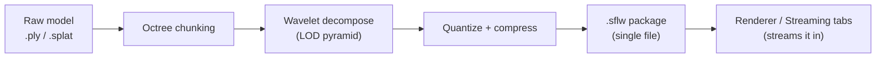
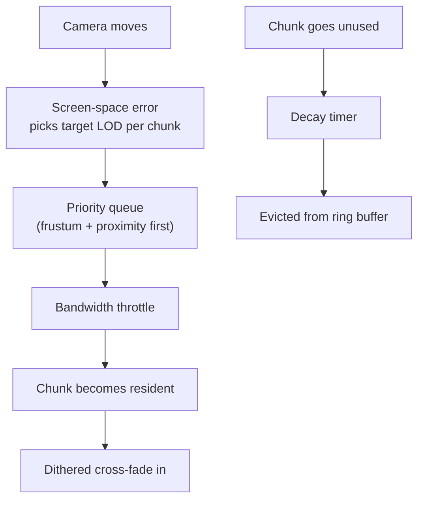
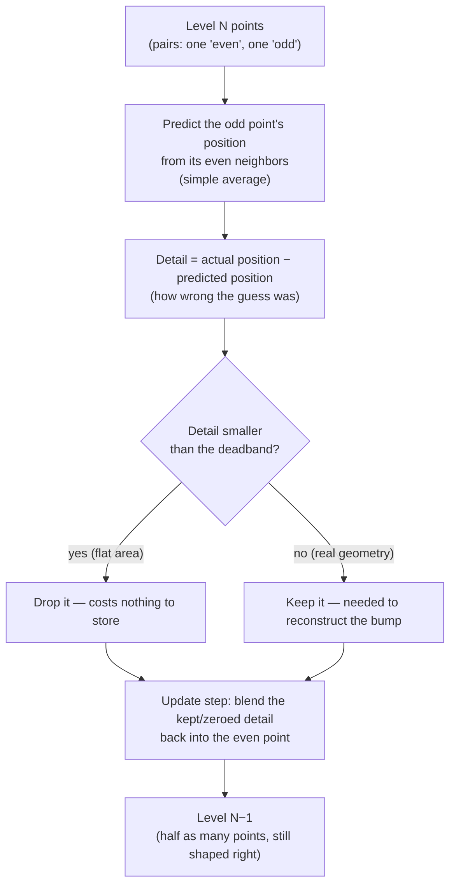

# SurfelLab User Guide

This guide describes how to operate the software. Readers seeking the technical architecture should consult [README.md](../README.md).

## Overview

The primary application is **SurfelLab**, a single window that combines the preprocessor and the viewer. Its three tabs carry a dataset from raw point cloud to streamed render without leaving the program:

1. **Surfel Generator** — loads a `.ply` or `.splat` file, exposes the chunking and compression parameters, and exports a `.sflw` package.
2. **Renderer** — displays the current dataset, or any previously exported package, using the GPU-driven mesh-shader renderer, with level-of-detail controls and the interior occlusion volume.
3. **Streaming** — simulates progressive delivery over a constrained connection and visualises which detail levels are resident.

SurfelLab is the recommended entry point, and every section of this guide describes it.

### Standalone versions

The same renderer is also available as separate components for situations in which only one half is required:

- **Surfels_DX12** is the standalone viewer. It contains no preprocessing interface. On launch it loads the `scene.sflw` package located beside the executable (or in a `models/` folder nearby) and streams it; if no package is present, it generates a synthetic benchmark package on first run. It is intended for viewer-only distributions and for observing the runtime in isolation. The script `bin/launch.cmd` starts it.
- **The preprocessor on its own.** SurfelLab accepts a file path on its command line. Dropping a point cloud onto `SurfelLab.exe` (or onto `bin/launch_surfellab.cmd`) opens it directly in the Surfel Generator tab. A package exported from there may be copied beside `Surfels_DX12.exe` as `scene.sflw`, after which the standalone viewer will load it.

Both programs share one code base for the renderer and the streaming manager, so the image shown in SurfelLab's Renderer tab is the image the standalone viewer produces.

## Getting Started

**Running a release build.** Download the latest build from the [Releases page](../../../releases), extract it, and run `SurfelLab.exe`. No installation is required. The only hardware requirement is a DirectX 12 Ultimate–class GPU (NVIDIA RTX 20-series or newer, AMD RDNA2 or newer).

**Building from source.** The Building section of [README.md](../README.md) gives the full procedure. In brief, the user runs `cmake .. -G "Visual Studio 18 2026" -A x64` from a `build/` directory and opens the generated solution. SurfelLab is the default startup project; Surfels_DX12 is available in the same solution for those who require the standalone viewer.

On first launch the application automatically loads a bundled Cthulhu bust, so the window is never empty.

## The Surfel Generator Tab: Converting Point Clouds to Surfel Streaming Format (.sflw)

Tab **1. Surfel Generator** provides the following workflow:

The output is a single `.sflw` file. It may be inspected in the Renderer tab, reloaded later, or placed beside the standalone viewer.

## The Renderer Tab: Streaming and Rendering a .sflw Model

Tab **2. Renderer** is where the model is examined. The most useful controls are:

- **Auto Distance LOD** — the default mode. Camera distance selects the detail level per chunk, so the model refines automatically as the camera approaches.
- **Dithered LOD Transitions** — replaces the abrupt switch between levels with a soft dissolve.
- **GPU Silhouette Edge Refinement** — keeps outlines crisp even while the interior of the model is coarse. This is the mechanism that allows distant objects to retain sharp edges.
- **Splat Radius Scale** — larger splats fill gaps in sparse data but appear blobby at close range. A value of 1.0× is the recommended starting point.

When a package contains an occlusion volume, an **Interior Occlusion Volume** section appears with an **Enable Occlusion Culling** checkbox. Enabling generation on the Surfel Generator tab, or moving its Shave slider, enables the checkbox automatically, so the volume is visible as soon as it exists. **View Occlusion Volume Only** displays the blocky solid alone so that it can be compared against the model. The shape of the volume, including its resolution and shave amount, is fixed when it is baked on the Surfel Generator tab; the Renderer tab offers no control that would alter it.

## The Streaming Tab: Network Streaming Simulator

Tab **3. Streaming** simulates progressive delivery over a constrained connection. It is useful both for demonstrations and for stress-testing the level-of-detail system.

- **Network Profiles** — one-click 3G, 4G, and 5G bandwidth presets, or a slider for arbitrary values. Streaming is unthrottled by default, so the model loads at full speed until a profile is selected.
- **Decay Rate** — the speed at which unused detail drains out of memory when it is not in view. A value of 0 disables decay; 10 drains every evictable level in approximately three seconds regardless of bandwidth, and 5 takes twice as long. Hovering over the slider shows the implied drain time.
- **Greedy vs Conservative** — Greedy continues to pre-fetch everything in the background; Conservative fetches only what is currently visible.

The **LOD Residency** panel on the right shows precisely which chunks are resident, in transition, or silhouette-locked at each level. Green bars filling from left to right are streaming in progress, made visible.

## The Performance Statistics Panel

The panel is ordered, top to bottom, roughly by how often each section is consulted:

1. **Real-Time Performance & Stage Timings** — frame rate and a per-stage breakdown (upload, sort, silhouette prepass, occlusion pass, main dispatch, TAA). When performance drops, this section identifies the responsible stage.
2. **4-Tier Compression Results** — the size reduction achieved by the package and its causes. The headline ratio is the size of the original point-cloud file against the size of the `.sflw` file; the original size is stored inside the package so the figure survives a reload.
3. **LOD Residency** — described above.
4. **Wavelet Multi-Resolution Pyramid** — clicking any row jumps directly to that level for inspection.
5. **Input Model Metrics / Geometry Optimizations & Culling Stats / Spatial Partitioning** — detailed diagnostics that are safe to ignore in ordinary use.

## Common Issues

- **The model shows only one LOD level.** The package was probably produced by an older version, or **Max Wavelet LODs** was set to 1. Re-exporting with more levels resolves this.
- **Streaming resembles a progress bar filling left to right rather than a patchwork.** This is the priority queue behaving correctly; edges and nearby chunks should still complete first even in that pattern. If loading appears purely sequential, the user should confirm that **Prioritize View Frustum & Proximity** is enabled.
- **Decay never seems to finish.** A Decay Rate of 10 empties every evictable level in about three seconds regardless of bandwidth. Levels that remain resident are therefore pinned: the two coarsest levels never drain, and silhouette chunks in view are locked while Silhouette LOD 0 is enabled.
- **Edges appear blocky at close range.** Raising **Silhouette LOD Bias**, or confirming that GPU Silhouette Edge Refinement is enabled, corrects this.

## Glossary

- **Chunk** — a spatial cube of surfels; the unit of streaming.
- **Surfel** — a coloured, oriented disc or point standing in for a small patch of surface; the three-dimensional analogue of a pixel.
- **LOD (Level of Detail)** — a coarser or finer version of the same chunk. The wavelet pyramid holds several.
- **Silhouette chunk** — a chunk that lies on the model's outline from the camera's point of view. Such chunks are refined first.
- **Decay** — the simulated cache eviction that drains unused detail out of memory.

## Appendix: Lifting Wavelet Compression

Each coarser level is not simply the finer level with every other point removed. It is built with a **second-generation lifting wavelet**, the same family of technique used in JPEG 2000. In short, the method discards detail selectively, preserving the overall shape even after several rounds of halving.

For every pair of neighbouring points at a level:

Two properties make this superior to naive decimation:

- **Prediction rather than deletion.** The "odd" point is not merely discarded. The difference between its predicted position (from its neighbours) and its actual position becomes a detail coefficient. Flat regions predict almost perfectly, so their detail coefficients are tiny.
- **Deadband sparsification.** Any detail coefficient smaller than the `Deadband Zero (mm)` threshold is set to zero outright. On a largely flat surface (a wall, a road, a torso) this applies to most coefficients, which is precisely why the compression ratio reported in the Compression Results panel is so favourable.

The "update" step also folds the surviving detail back into the coarser point so that it does not drift. It re-averages normal and colour, and scales the splat radius by √2 per halving, so that a coarse point still covers the same physical area that its two children covered.

The process repeats level by level until `Max Wavelet LODs` is reached or too few points remain to split further.
