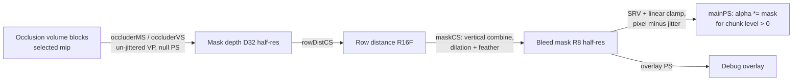

# Design: Splat bleed mask

Requirements: docs/requirements/splat-bleed-mask.md
Status: withdrawn (superseded by splat-coarse-level-billboards on 2026-09-07; implementation parked in git stash "splat bleed mask (withdrawn)")
Date: 2026-09-07

## Summary
The renderer gains a half-resolution screen-space mask built from the interior occlusion volume's
silhouette: a depth-only draw of the occluder cubes with the un-jittered camera, then two compute
passes that turn coverage into a bounded Euclidean distance and map it through dilation and feather
to a 0..1 mask. The splat pixel shader samples the mask for every Gaussian whose chunk level is
above 0 and multiplies its alpha by the mask, so coarse-level bloom outside the rim vanishes while
level 0 is untouched. The mask is rebuilt only when a CPU-side key (un-jittered view-projection,
target size, occlusion level, occlusion volume version, dilation and feather in pixels) changes,
and a GPU timestamp pair reports the rebuild cost. Everything is public renderer code in
`src/SurfelsCore`; the codec library and the package format do not change.

## Components touched
| Area | Files | Change |
|------|-------|--------|
| Renderer state and API | `src/SurfelsCore/SurfelsRenderer.h` | New `State` fields for the mask controls, new members for the mask resources, PSOs, compute passes, rebuild key, GPU timestamps, and getters for the timing panel. |
| Renderer passes | `src/SurfelsCore/SurfelsRenderer.cpp` | Root signature gains one SRV descriptor table and a linear-clamp static sampler; new depth-only occluder PSOs (mesh and vertex paths); two `PostProcCS` passes; half-res resources in the window-size resources; the rebuild decision and pass sequence in `OnRender`; the debug overlay draw; timestamp collection. |
| Splat shaders | `src/SurfelsCore/Shaders/Surfels.hlsl` | Constant-buffer fields, the mask texture and sampler, a chunk-level interpolant on `VSOut`, mask sampling in `mainPS`, and the overlay vertex and pixel shaders. |
| Mask compute | `src/SurfelsCore/Shaders/BleedMaskCS.hlsl` (new) | `rowDistCS` and `maskCS`. |
| Shader install | `src/SurfelsCore/CMakeLists.txt` | Add the new shader to the list that is copied to `bin/ShaderLibDX`. |
| App UI, config, state sync | `src/SurfelsCore/SurfelsApp.h`, `src/SurfelsCore/SurfelsApp.cpp` | Two Bleed Mask checkboxes under the Interior Occlusion Volume header, frame-breakdown line, four `config.json` keys, per-frame copy into the renderer `State`. |
| Docs | `docs/USER_GUIDE.md` | One paragraph on the Bleed Mask group and the config keys. |

## Data flow

1. **Rebuild decision (CPU).** `OnRender` fills a `BleedMaskKey` and compares it with the last one
   built. On mismatch, or when the mask resources were recreated, the three GPU stages below are
   recorded and the key is stored. Otherwise nothing is recorded and the mask texture, which stays
   in the shader-resource state between frames, is reused.
2. **Occluder silhouette draw.** A second `SurfelsCB` is allocated for the frame with `viewProj`
   set to the un-jittered matrix and the same occlusion mip range as the main pass. The depth-only
   PSO (mesh path: `occluderMS`, vertex paths: `occluderVS`; no pixel shader; zero render targets;
   depth write, LESS) draws into the half-res mask depth buffer after clearing it to 1.0.
3. **Row distance.** `rowDistCS` reads the mask depth as an SRV. A pixel is covered when depth < 1.
   For each pixel it scans up to `radiusPx` texels left and right and writes the distance to the
   nearest covered texel, or `radiusPx + 1` when none is found. Covered pixels write 0.
4. **Mask.** `maskCS` reads the row distance as an SRV and, for offsets `j` in `-radiusPx..radiusPx`,
   takes `min(sqrt(row[y+j]^2 + j^2))`. That is the exact Euclidean distance to coverage within the
   radius. The output is `1 - smoothstep(insidePx, insidePx + featherPx, d)`, written to the R8 mask.
5. **Consumption.** `mainPS` in splat mode, when the mask is enabled and the interpolated chunk
   level is above 0.5, samples the mask with the linear-clamp sampler at
   `(pos.xy - jitterPixels) / screenSize` and multiplies the Gaussian alpha by the
   mask value before the existing 1/255 discard.
6. **Pixel units.** `insidePx = dilationCells * cellPixels + marginPx`, where `cellPixels` is the
   renderer's existing projected occlusion cell size for the mip in use. `featherPx` is the feather
   control. Both are converted to half-res texels (divide by 2) before going into the key and the
   constant buffer. `radiusPx = ceil(insidePx + featherPx) + 1`, clamped to 96 half-res texels so the
   compute cost is bounded; the clamp is logged once through the trace when it engages.
7. **Timing.** A Cauldron `GPUTimestamps` instance sized to the swap chain's back-buffer count is
   created in `OnCreate`. Each frame stamps "Frame Begin" at the top of `OnRender`; a rebuild
   stamps "Bleed Mask Begin" before the silhouette draw and "Bleed Mask" after `maskCS`.
   `CollectTimings` runs before the command list closes. The "Bleed Mask" entry's delta is the
   rebuild's GPU time, stored in a member with the frame's rebuilt/held flag for the timing panel.
8. **Frame breakdown.** The mask is a named step of the frame breakdown like the occlusion volume
   pass: `FrameTimingMetrics` gains `bleedMaskTimeMs` (CPU command-recording time of the rebuild,
   0 on a held frame, measured the same way as `occluderPassTimeMs`), the renderer keeps a smoothed
   `m_smoothBleedMaskMs` fed only on rebuild frames (the pattern the silhouette prepass used), and
   the breakdown line sits between "Occlusion Volume Pass" and the main splat dispatch. The line
   shows the smoothed CPU record time in the same column as its siblings, then the GPU time and the
   rebuilt/held state in brackets. The rebuild is inside the section that `gpuDispatchTimeMs`
   already spans, so the section total includes it without further change.

## Render path impact
- **mesh:** depth-only PSO uses `occluderMS` with a null pixel shader, `NumRenderTargets = 0`,
  DSV `D32_FLOAT`. The two compute passes run through `PostProcCS` (cs_6_0). `mainPS` gains the
  mask sample; `mainMS` writes the chunk level into the new interpolant.
- **VS SM6:** depth-only PSO uses `occluderVS` (vs_6_0) with a null pixel shader. `mainVS` writes
  the chunk level. Compute passes identical to the mesh path.
- **VS SM5 (FXC):** the same `occluderVS`, `mainVS`, `mainPS` and overlay shaders compile through
  the legacy compiler with the profile rewritten to 5_1. `BleedMaskCS.hlsl` compiles as cs_5_1 by
  the same rewrite: it uses no wave intrinsics and no typed UAV loads. Both passes read their input
  through SRVs and only store to their UAV, so no typed-load format support is needed. The mask
  texture is sampled through a static sampler, which SM5 supports.

## Public / private placement
All files are public app code in `src/SurfelsCore` and `docs/`. The mask consumes the occlusion
volume through the existing `State::pOcclusionVoxels` and mip table and reuses the packaged data
as is. No file in `libs/bluesec-codec` changes, no `.sflw` field is added, and nothing here
depends on `docs/private/` or any other path the public sync strips.

## Decisions
- **Independent depth-only silhouette draw** rather than reading the main depth after the visible
  occluder pass: keeps the mask available with Show Occlusion Volume off, avoids the jittered
  projection in the main pass, and decouples the mask from the display/linear blend PSO pairs.
  Costs one extra draw of the selected mip's blocks per rebuild.
- **Half-resolution mask.** The feather is at least a few pixels wide, so half res is invisible in
  the result and makes the compute passes four times cheaper. Rejected: full res (budget risk on
  the SM5 path) and quarter res (visible stair-stepping on the feather).
- **Bounded separable Euclidean distance** (row scan, then vertical combine) rather than a jump
  flood: two dispatches, exact within the radius, trivially SM5-safe, and the radius is small.
  Rejected: jump flood (more passes, more resources) and a box dilation (square structuring element
  shows at corners).
- **Texture SRV plus static sampler** in the shared root signature rather than a structured buffer
  with manual bilinear: hardware filtering in the pixel shader, one root parameter appended at
  the end so every existing binding index stays the same.
- **Rejection mechanism: distance field sampled per pixel.** The bloom is inside a splat (centre on
  the surface, footprint spilling past the rim), so only a per-pixel test can cut a splat part way.
  Rejected: fixed-function stencil (per-draw test cannot exempt level 0 inside one sorted draw
  without the optional pixel-shader stencil-reference feature, binary edge with no feather, and a
  depth-format change touching every PSO and the temporal filter); a task-shader test (splat-mode
  groups are 64 consecutive slots of the depth sort with no useful screen bounds); a mesh-shader
  whole-splat test as the primary mechanism (it can only accept or reject whole quads, and the quad
  must not be reshaped because the render path copies the reference viewer's math). A whole-splat
  pre-test is kept as Stage 2 below, as an optimisation layered on the per-pixel test.
- **Chunk level as an interpolant** rather than a per-draw split: splat mode relies on one global
  back-to-front sort, so the level must travel with the splat. One float on `VSOut` is the smallest
  change across all three paths.
- **Rebuild key compared on the CPU**: cheap, deterministic, and mirrors the pattern the renderer
  already uses. The key deliberately excludes the chunk list, so streaming never rebuilds the mask.
- **Visualize Masked overlay as a full-screen triangle draw** with its own tiny vertex and pixel
  shader, alpha-blended over the scene after the splat pass and before the temporal filter. Works
  on all three paths; no assumption that the scene colour buffer allows unordered access. One
  colour (magenta) at alpha `0.10 * (1 - mask)`: fully tinted outside, fading through the feather,
  untouched inside.
- **Two UI controls only** (Bleed Mask, Visualize Masked). Strength is dropped: masked coverage is
  removed entirely. Dilation, margin and feather are fixed defaults (1.5 cells, 4 px, 6 px) exposed
  only as `config.json` keys so a dataset whose rim clips can be fitted without a rebuild.
- **Config default enabled = true, persisted.** A user who turns it off keeps it off across runs,
  matching the other persisted keys.
- **Held-frame cost** is only the mask sample in the pixel shader, taken inside a branch on the
  enable flag and the level interpolant.

## Test plan
- Existing test exes (TestGPUSort, TestBitonicCPU, TestGeometryCull, TestOcclusionVolume,
  TestLoadPackage, TestSplatCodec, CompressVenus) are unaffected; they must still build and pass.
- `tests/stress_test.py` is unaffected; run once to confirm.
- App smoke test (tester agent), with the bundled Cthulhu splat package in Viewer mode and the
  temporal filter off:
  1. Preview level forced to 2: screenshots with the mask on and off. On: no halo beyond the rim.
  2. Every chunk at level 0: on/off screenshots identical.
  3. Show Occlusion Volume off, level 2: halo still removed.
  4. Camera still for 60 frames: timing panel says held after the first frame. Orbit: rebuilt.
  5. Timing panel Bleed Mask GPU time at 1920x1080 at most 0.5 ms.
  6. Repeat 1 and 3 with `--render-path mesh`, `vs6`, `vs5`; screenshots match.
  7. Visualize Masked overlay on and off.
  8. Toggle Bleed Mask off, restart, restored off; edit `bleed_mask_margin_px`, overlay region changes.
  9. A disc mode: group hidden, frame unchanged.
  10. Temporal filter on, 10 second orbit: no rim swimming.
  11. A splat package without an occlusion volume: warning shown in the Renderer tab and the status
      overlay, no controls.
  output directly inspectable.

## Stage 2 (follow-up, not part of this implementation brief)
A whole-splat pre-test in the splat sort's expand stage (`ExpandCS` in `SplatSortCS.hlsl`), which
already runs once per splat per frame and owns the culled bit. For a splat in a chunk above level 0:
project its centre with the viewer's un-jittered view-projection, sample the bleed mask (as a
distance rather than the 0..1 value, so the mask pass would also write a distance channel), and
flag the slot culled when the centre's distance to coverage exceeds `insidePx + featherPx` plus a
conservative screen radius from the splat's largest scale axis. Level 0 splats and Detach Camera
frames (the sort culls with the frozen camera, not the viewer) are never pre-culled. This needs the
mask SRV and sampler in the sort root signature and the mask build moved ahead of the sort in
`OnRender`. It removes floaters that lie entirely outside the rim and saves their rasterisation and
blending; it does not change the result for straddling splats, which the per-pixel test handles.
Acceptance for Stage 2 would be: a screenshot identical to Stage 1 for the bundled package, and a
lower sorted-slot count and main-dispatch time on a view with floaters. Scheduled after Stage 1 has
been tested and reviewed.

## Risks
- **Occluder erosion larger than the dilation** at a given zoom would clip real rim splats. The
  dilation follows the projected cell size, and the `bleed_mask_margin_px` key covers residual gaps;
  the overlay shows where the mask edge sits relative to the rim.
- **GPU timestamp readback lag** means the panel value is a few frames behind; acceptable for a
  budget check, noted in the tooltip.
- **Null pixel shader with a mesh-shader PSO**: valid in D3D12, but the debug layer may warn if the
  mesh shader still declares colour outputs. If a driver rejects it, fall back to a trivial pixel
  shader returning nothing with zero render targets.
- **Root signature growth** touches every PSO that uses it. Appending the parameter keeps indices
  stable; the coder must not reorder existing parameters.
- **Radius clamp** at 96 half-res texels caps the dilation when the model is very close to the
  camera; the trace line makes that visible rather than silent.

## Implementation brief (for the coder agent)
1. `src/SurfelsCore/SurfelsRenderer.h`: add to `State`: `bool bleedMaskEnabled = true; float bleedMaskDilationCells = 1.5f; float bleedMaskMarginPx = 4.0f; float bleedMaskFeatherPx = 6.0f; bool visualizeMasked = false;`. Add members: half-res `Texture m_bleedDepth` (DSV + SRV), `m_bleedRowDist` (R16_FLOAT, UAV + SRV), `m_bleedMask` (R8_UNORM, UAV + SRV) with their descriptor slots; `ID3D12PipelineState* m_pOccluderDepthOnlyPSO`; `PostProcCS m_bleedRowDistCS, m_bleedMaskCS`; a `BleedMaskKey` struct (un-jittered `XMFLOAT4X4`, `uint32_t width, height, mip, voxelVersion; float insidePx, featherPx`) with `m_lastBleedKey` and `bool m_bleedMaskValid`; `GPUTimestamps m_gpuTimestamps` and `std::vector<TimeStamp> m_gpuTimings`; `float m_bleedMaskGpuMs`, `bool m_bleedMaskRebuiltThisFrame`, `float m_smoothBleedMaskMs`; `FrameTimingMetrics::bleedMaskTimeMs`; getters `GetBleedMaskGpuMs()`, `WasBleedMaskRebuilt()`, `GetSmoothBleedMaskMs()`. Add `SurfelsCB` fields `uint32_t bleedMaskEnabled; float bleedJitterX, bleedJitterY; float screenWidth, screenHeight;` plus padding to 16 bytes. Done when: the header compiles and the CB struct size is a multiple of 16.
2. `src/SurfelsCore/Shaders/Surfels.hlsl`: mirror the CB fields; declare `Texture2D<float> g_BleedMask : register(t9); SamplerState g_LinearClamp : register(s0);`; add `float lod : TEXCOORD5;` to `VSOut`, set it in `CulledSplatVertex` (0), `GaussianCornerVertex` (new parameter), `SplatCornerVertex` (0), and pass the chunk level out of `SplatFromSlot` (new `out float lod`, from `chunk.lodLevel` when chunked, else 0) through `mainMS` and `mainVS`. In `mainPS` splat branch, before the 1/255 discard: `if (g_BleedMaskEnabled != 0 && i.lod > 0.5) { float2 uv = (i.pos.xy - float2(g_BleedJitterX, g_BleedJitterY)) / float2(g_ScreenWidth, g_ScreenHeight); alphaG *= g_BleedMask.SampleLevel(g_LinearClamp, uv, 0); }`. Add `bleedOverlayVS` (full-screen triangle from `SV_VertexID`) and `bleedOverlayPS` (samples the mask at `pos.xy / screenSize`, returns magenta with alpha `0.10 * (1 - mask)`). Done when: the file compiles for ms_6_5/ps_6_5, vs_6_0/ps_6_0 and vs_5_1/ps_5_1 through the app's existing paths.
3. `src/SurfelsCore/Shaders/BleedMaskCS.hlsl` (new): `cbuffer BleedMaskCB : register(b0) { uint2 g_Size; float g_InsidePx; float g_FeatherPx; uint g_RadiusPx; float3 pad; }`. `rowDistCS` (16x16): `Texture2D<float> g_Depth : t0`, `RWTexture2D<float> g_RowDist : u0`, scan as in Data flow step 3. `maskCS` (16x16): `Texture2D<float> g_RowDist : t0`, `RWTexture2D<float> g_Mask : u0`, combine as in step 4. No wave intrinsics, no UAV loads. Done when: both entry points compile as cs_6_0 and as cs_5_1 through the legacy compiler (run the app once with `--render-path vs5`).
4. `src/SurfelsCore/CMakeLists.txt`: add `BleedMaskCS.hlsl` to the shader list so it lands in `bin/ShaderLibDX`. Done when: the file is present in `bin/ShaderLibDX` after a build.
5. `src/SurfelsCore/SurfelsRenderer.cpp` `OnCreate`: append root parameter 10 as a descriptor table of one SRV (t9, pixel visibility) and one static sampler (s0, linear, clamp, all visibility) to the main root signature without reordering existing parameters; create `m_pOccluderDepthOnlyPSO` (mesh: `occluderMS`, null PS; vertex paths in `CreateVertexShaderPipelines`: `occluderVS`, null PS; zero RTVs, DSV `D32_FLOAT`, depth write LESS, opaque); create the two `PostProcCS` objects from `BleedMaskCS.hlsl` with one UAV and one SRV each; create the overlay PSO (alpha blend, no depth) for both the UNORM and sRGB target formats like the splat PSOs; create `m_gpuTimestamps` with the back-buffer count the constant-buffer ring uses. Release all of it in `OnDestroy` and the vertex-path release block. Done when: `Surfels_DX12` starts on all three render paths with no new error trace lines.
6. `src/SurfelsCore/SurfelsRenderer.cpp` `OnCreateWindowSizeDependentResources` / `OnDestroyWindowSizeDependentResources`: create and destroy the three half-res textures (`max(1, width/2)` by `max(1, height/2)`), their DSV/SRV/UAV descriptors, and the SRV table entry the pixel shader binds; set `m_bleedMaskValid = false` on create. Done when: resizing the window does not trigger debug-layer errors and the next frame rebuilds the mask.
7. `src/SurfelsCore/SurfelsRenderer.cpp` `OnRender`: (a) stamp "Frame Begin" after the command list is ready and call `m_gpuTimestamps.OnBeginFrame` / `OnEndFrame` around the frame, `CollectTimings` before close; read the "Bleed Mask" entry into `m_bleedMaskGpuMs`. (b) After `SelectOcclusionMip` and the CB fill, when `renderMode == 3`, `bleedMaskEnabled || visualizeMasked`, an occlusion volume is loaded and the voxel buffer is valid: compute `cellPixels` from the existing mip selection, `insidePx`, `featherPx` (half-res texels), `radiusPx` with the 96 clamp and a one-time trace when clamped; build the key; if it differs from `m_lastBleedKey` or `!m_bleedMaskValid`: allocate a second `SurfelsCB` copy with the un-jittered `viewProj`, transition the mask depth to `DEPTH_WRITE`, clear it, set the half-res viewport and scissor, bind root parameter 5 to the voxel buffer, draw with the depth-only PSO (DispatchMesh or DrawInstanced(36, blocks) as `DrawOccluderPass` does), transition depth to shader-resource, run `rowDistCS` and `maskCS` with UAV barriers, transition the mask to `ALL_SHADER_RESOURCE`, restore the main viewport, scissor and render targets, stamp "Bleed Mask Begin" / "Bleed Mask" around the block, time the block on the CPU into `m_metrics.bleedMaskTimeMs` exactly as `DrawOccluderPass` times itself, store the key, set `m_bleedMaskValid` and `m_bleedMaskRebuiltThisFrame = true`; else set the flag false and leave `bleedMaskTimeMs` at 0. In the end-of-frame smoothing block, feed `m_smoothBleedMaskMs` only when `bleedMaskTimeMs > 0.0001f`, as the silhouette prepass EMA did. (c) Fill the main CB's `bleedMaskEnabled` (only when the mask exists and is enabled), `bleedJitterX/Y` in pixels (from the Halton offset used for `viewProj`, y sign flipped for pixel space, 0 when jitter is off), `screenWidth/Height`. (d) Bind root parameter 10 to the mask SRV table for the main splat draw. (e) After the main splat draw, when `visualizeMasked`, draw the overlay (3 vertices, no depth). Done when: acceptance criteria 2, 3, 4, 5, 7 and 8 pass in the app.
8. `src/SurfelsCore/SurfelsApp.h`: add `bool m_bleedMaskEnabled = true; float m_bleedMaskDilationCells = 1.5f; float m_bleedMaskMarginPx = 4.0f; float m_bleedMaskFeatherPx = 6.0f; bool m_visualizeMasked = false;` (the overlay flag is not persisted). Done when: it compiles.
9. `src/SurfelsCore/SurfelsApp.cpp` config: parse `bleed_mask_enabled` (true/false, like `show_control_hints`), `bleed_mask_dilation_cells` (0..4), `bleed_mask_margin_px` (0..32), `bleed_mask_feather_px` (1..32) next to `occlusion_shave_bias`, JSON and INI forms; write all four in the save block after `occlusion_shave_bias`. Done when: acceptance criterion 9 passes.
10. `src/SurfelsCore/SurfelsApp.cpp` UI: when `m_splatMode` and `m_occlusionVoxels` is empty, show `ImGui::TextColored` in warning orange, wrapped: "No occlusion volume: cannot create bleed mask. Rebake with the occlusion volume enabled to remove glow artefacts." in place of the Interior Occlusion Volume header, and add the same text to the status-overlay `add(...)` list next to the SPLAT line. Inside the "Interior Occlusion Volume" collapsing header after `DrawOcclusionVolumeControls()`, when `m_splatMode`, add two checkboxes and nothing else: "Bleed Mask" (tooltip: masks coarse-level Gaussian bloom outside the model's silhouette using the occlusion volume; level 0 is never affected; fit is tuned through the bleed_mask_* keys in config.json) and "Visualize Masked" (tooltip: tints pixels that fail the mask test at 10% opacity). In the frame breakdown, directly after the "Occlusion Volume Pass" line and before the main splat dispatch line, when `m_splatMode` and the mask is enabled, add "  • Bleed Mask:                       %.2f ms  (GPU %.2f ms, rebuilt|held)" using `GetSmoothBleedMaskMs()`, `GetBleedMaskGpuMs()` and `WasBleedMaskRebuilt()`, in the same colour family as the occlusion volume line, with a tooltip explaining that the first number is CPU command-recording time like its siblings and the GPU number lags by the swap-chain ring. Copy all five values into `m_state` in the per-frame block next to `enableOcclusionCulling`. Done when: acceptance criteria 1, 6, 10 and 12 pass and the group is absent in disc modes.
11. `docs/USER_GUIDE.md`: add a short paragraph under the Renderer tab describing the two Bleed Mask checkboxes and the four config keys. Done when: the paragraph is present and mentions both controls and every key.
12. Build `Surfels_DX12`, `SplatLab` and all test targets in Release; run the test exes and `tests/stress_test.py`; commit on the current branch with a message that names the feature. Done when: the build is clean and the tests pass.
